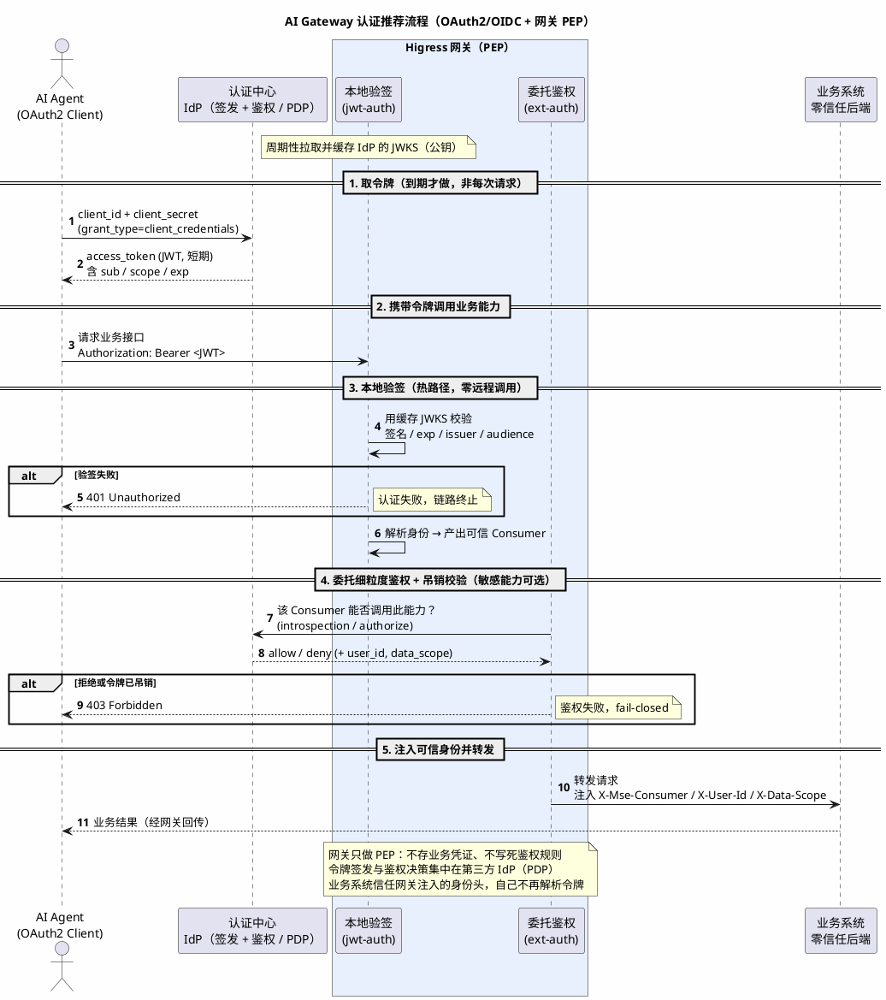

# AI Gateway 鉴权系统设计最佳实践

> 适用读者：平台团队、业务系统团队、安全团队
> 主题：**AI Gateway 场景下的鉴权系统「方案设计」**（不含具体配置）
> 一句话结论：把鉴权能力下沉到网关，用「**认证/鉴权分离 + PEP/PDP 分离 + Consumer 统一身份**」三条主线，实现一次接入、集中治理、业务零侵入。

---

## 1. 背景与设计目标

### 1.1 AI Gateway 场景的特殊性

Agent 调用业务系统，本质是「**不确定的调用方**（LLM 推理出的动作）访问**确定的能力**（业务接口/MCP 工具）」。相比传统 API 调用，鉴权系统面临三个新挑战：

1. **调用方爆炸**：一个 Agent 平台背后对接几十个业务系统、上百个工具，认证方式各异，不可能逐系统重复建设。
2. **调用方不可预期**：行为由大模型驱动，可能被提示词注入诱导越权，不能依赖调用方「自律」。
3. **高频自动化**：Agent 高并发、自动重试地访问下游，任何鉴权设计上的低效或漏洞都会被放大。

### 1.2 鉴权系统要解决的核心问题

| 问题 | 含义 |
|------|------|
| **谁在调**（认证） | 可信地识别调用方身份，且身份可被全链路复用 |
| **能调什么**（鉴权） | 精细到「某调用方能否访问某能力」，规则集中可维护 |
| **怎么接入** | 多业务系统统一接入，认证方式集中管理，不重复造轮子 |
| **怎么不侵入** | 业务系统专注业务逻辑，不碰凭证、不接 IdP |

### 1.3 设计目标（贯穿全文的五条原则）

1. **集中管控**：调用方清单、认证方式、授权规则集中在统一位置维护。
2. **标准协议**：优先 OAuth2/OIDC/JWT 等标准，避免私有协议绑架。
3. **认证鉴权分离**：「你是谁」与「你能干什么」解耦，各自演进。
4. **零信任身份透传**：业务系统信任网关注入的身份，自己不再解析令牌、不存凭证。
5. **最小权限 + 默认拒绝**：能力默认不可达，显式授权才放行；鉴权链路异常时 fail-closed。

---

## 2. 核心设计理念

整个鉴权系统建立在三条相互正交的主线上。理解这三条，就理解了全部设计。

### 2.1 主线一：认证与鉴权分离

把流程切成两层，职责清晰、可独立演进：

- **认证（Authentication）**：识别「你是谁」，产出一个**可信身份**。
- **鉴权（Authorization）**：判断「这个身份能不能访问这个能力」。

> 关键：认证只做一次（在入口），产出的身份被后续所有环节复用；鉴权按「能力」分散声明，互不耦合。两者解耦后，换认证方式不影响授权规则，调整授权不影响认证。

### 2.2 主线二：PEP / PDP 分离

来自访问控制标准模型（XACML/NIST），把「执行」和「决策」拆开：

| 角色 | 全称 | 职责 | 在本方案中是谁 |
|------|------|------|---------------|
| **PEP** | Policy **Enforcement** Point | 拦截每个请求并**执行**放行/拒绝 | **Higress 网关** |
| **PDP** | Policy **Decision** Point | 根据规则**判定** allow/deny | **统一认证/授权中心（IdP）** |

类比：PEP 是检票员（站门口执行），PDP 是票务系统（后台判定规则）。

分离的价值：
- **规则集中**：授权逻辑在 PDP 一处维护，改规则不动网关、不动业务。
- **执行下沉**：PEP 离流量最近，入口即拦截，性能好。
- **可替换**：换 IdP 不影响网关，网关扩容不影响规则。

> 补充：完整模型还有 PIP（提供决策所需属性，如角色/部门）和 PAP（管理员写规则的地方）；日常抓住 PEP（执行）+ PDP（判定）这对核心即可。

### 2.3 主线三：Consumer 统一身份模型

这是把上面两条主线「焊」在一起的地基。网关把所有调用方抽象成统一的 **Consumer（消费者）**：

- 认证插件识别出 Consumer 身份后，通过统一的身份标识（如 `X-Mse-Consumer`）**透传**给后续环节；
- 鉴权、审计、可观测全部基于同一个 Consumer 身份展开，实现「**一次认证、处处可用**」。

> **延伸价值**：这套身份模型不止服务鉴权——下游的限流、配额、调用审计、成本归集同样复用 Consumer 身份。**好的身份设计是整个治理体系的地基**（本文聚焦鉴权，限流/配额另文展开）。

### 2.4 整体架构

```
                 ┌──────────────────────────────────────────────┐
  AI Agent ─────▶│                 Higress 网关 (PEP)             │────▶ 业务系统 A
 (LLM 驱动)       │                                              │────▶ 业务系统 B
                 │   ① 认证            ② 鉴权                     │────▶ MCP 工具集
                 │ ┌─────────┐   ┌──────────────────┐           │
                 │ │ 识别身份  │──▶│ 判定能否访问该能力 │──▶ 注入身份 │
                 │ │jwt/oidc │   │ allow / ext-auth │   到下游   │
                 │ │key/ext  │   │ / opa            │           │
                 │ └────┬────┘   └────────┬─────────┘           │
                 └──────┼─────────────────┼─────────────────────┘
                        ▼                 ▼
              ┌──────────────────────────────────┐
              │  统一认证 / 授权中心 (IdP, PDP)     │  ← 令牌签发 + 鉴权决策集中于此
              └──────────────────────────────────┘
```

---

## 3. 认证方案设计（你是谁）

### 3.1 认证方式的选择维度

选认证方式不看「哪个最强」，而看四个维度匹配：

| 维度 | 问题 |
|------|------|
| **信任模型** | 调用方是内部可信，还是需要标准化的外部信任？ |
| **身份上下文** | 是否需要携带用户/scope 等上下文随调用传递？ |
| **是否已有 IdP** | 企业是否已有统一认证中心可复用？ |
| **安全要求** | 是否需要防重放、令牌吊销、签名等高安全特性？ |

Higress 侧可承接的认证能力（按从轻到重）：`key-auth`（API Key）→ `jwt-auth`（标准 JWT）→ `hmac-auth` + 防重放（签名链路）→ `oidc`（SSO 登录态）→ `ext-auth`（把认证决策整体委托外部服务）。

### 3.2 推荐方案：OAuth2/OIDC + 网关 PEP

当企业已有（或计划建设）统一认证中心时，**最合理的认证方案**是：

> **网关只做 PEP，把令牌签发集中交给第三方认证中心（IdP），网关用标准协议（OAuth2/OIDC + JWT）校验令牌、注入可信身份给后端。**

为什么是它（对比其它做法）：

| 做法 | 问题 | 结论 |
|------|------|------|
| 网关硬编码 API Key | 凭证分散、无法携带用户上下文、吊销靠改配置 | 仅适合内部低危 |
| 每个业务系统各自接 IdP | 重复建设、实现不一致、零信任难落地 | ✗ 反模式 |
| **网关统一对接第三方 IdP** | 集中签发、标准协议、业务零侵入、令牌可吊销 | ✓ 推荐 |

合理性来自四点：**① 单点签发集中管控**；**② 网关不存业务密钥**（被攻破也拿不到长期凭证）；**③ 短期令牌 + 可吊销**（降低泄露窗口）；**④ 身份透传**（业务系统不再各自解析令牌）。

> 调用模式：Agent 这种「机器对机器」用 OAuth2 **Client Credentials**；若 Agent「代表某用户」调用，用 **On-Behalf-Of / 令牌交换**，把用户身份透传下去。

### 3.3 令牌校验的两种模式（核心取舍）

网关校验令牌有两种模式，按场景选择，也可叠加：

| 模式 | 实现 | 优点 | 代价 | 适用 |
|------|------|------|------|------|
| **本地验签** | 网关缓存 IdP 公钥（JWKS），本地验 JWT 签名/有效期 | 无远程调用、性能最好、IdP 抖动不影响热路径 | 令牌吊销有延迟（到期前仍有效） | 高频常规调用 |
| **委托校验** | 网关每次回调 IdP introspection/authorize | 支持实时吊销、动态细粒度鉴权 | 每请求一次远程调用，依赖 IdP 可用性 | 敏感能力、需实时吊销 |

> 工程上常用**混合策略**：热路径走本地验签保性能，对敏感能力叠加委托校验拿实时吊销与动态鉴权。

### 3.4 认证流程（PlantUML 时序图）



---

## 4. 鉴权方案设计（能干什么）

认证产出可信身份后，鉴权决定这个身份能访问哪些能力。本章的核心原则只有一句，其余都是它的推论。

### 4.1 第一原则：授权单元永远不是「路由」

直觉上会想：「路由在网关里，授权关系（谁能调哪条路由）也放网关或同步给授权中心」。**这是反模式**——它会让「加一条路由」变成「操作两个系统」的配对问题。调研主流网关（AWS API Gateway、Envoy、Apigee、OPA 生态）后可以确认：**没有任何生产级网关把路由清单同步给 PDP**。

它们共同遵循的原则是：

> **授权单元是 scope / 能力标签 / 路径模式 / API Product 这类抽象，不是「路由」。**
> 这个抽象要么**被路由自身携带**（路由自描述），要么**被模式匹配**。「路由 → 授权单元」的绑定永远跟路由同处一地（一处维护）；「谁拥有这个单元」的 grant 独立活在 IdP/PDP。**两边谁都不枚举对方**——这就是没有同步问题的根因。

### 4.2 业界四种落地模式（两大流派）

| 模式 | 代表网关 | 授权单元 | 绑定位置 | 加一条「复用既有权限」的路由 |
|------|---------|---------|---------|------------------------------|
| **A1 scope 自声明** | AWS API GW（`authorizationScopes`）、Apigee、Kong-OIDC | OAuth2 scope | 路由上的一个字段 | 只配路由的 scope 字段，**一个系统** |
| **A2 路由带不透明上下文** | Envoy `ext_authz`（`context_extensions`） | 能力标签 | 路由上的一组 KV | 只配路由的标签，**一个系统** |
| **B1 属性策略引擎** | OPA/Rego、Istio `AuthorizationPolicy` | 路径模式 + 属性 | 策略（按模式写，非枚举路由） | 匹配既有模式 → **零改动** |
| **B2 Product/Policy 抽象** | Apigee API Products、Tyk Policy、Kong ACL | API Product / 权限组 | 路由归入 Product | 把路由归入既有 Product，**一个动作** |

**流派 A：决策预烤进令牌**（A1/A2）
- **A1（推荐默认）**：路由声明它需要的 scope（如 `orders:write`）——这是路由的固有字段，定义路由时一起写。IdP 只在签发令牌时决定「这个 client 能拿哪些 scope」，**它从不知道有哪些路由**。网关做无状态匹配：`token.scopes ⊇ route.required_scope`。
- **A2**：Envoy 把「路由携带不透明上下文」做成了一等公民——每条路由挂一组 KV（如 `{capability: orders.write}`），原样发给授权服务；授权服务认这个标签、不持有路由表。
- 取舍：粗粒度、改 grant 要等令牌过期（吊销有延迟）；无 per-request 远程调用，性能最好。**80% 的角色化、稳定权限场景首选。**

**流派 B：决策外置给策略引擎**（B1/B2）
- **B1**：网关把 `{method, path, headers, 解码 JWT}` 作为 input 传给 OPA，OPA 用**通用策略**（如「带 orders 角色的可访问 `/orders/**`」）判，**不枚举路由**。加一条匹配既有模式的新路由 → OPA 零改动。「谁是什么角色」这类**数据**经 bundle/OPAL **自动同步**进 OPA，绝非手动录路由。
- **B2**：用「API Product」中间层把 grant 和路由解耦——消费者被授权的是 Product 而非单条路由；往 Product 里加一个 operation 自动对所有已授权的消费者生效。
- 取舍：细粒度、可实时吊销、策略可版本化可审计；代价是每请求一次决策调用 + 要写好通用策略。**敏感、动态、数据相关的授权用它。**

**结论**：90% 的日常加路由只碰一个系统（甚至零）。唯一触发跨系统协同的，是「**引入一个全新权限类别**」（新 scope / 新 Product / 新策略）——这本就是该由安全团队拍板的安全决策，不是路由管道操作。若确实需要 PDP 持有「能力目录」（如给授权 UI 勾选），方向必须是**从网关自动派生、单向发布**，人只管 grant，永不手动双录。

### 4.3 身份透传到业务系统（零信任后端）

鉴权设计的终点是让业务系统「**信任网关、不再自己鉴权**」：

- 网关把解析/判定出的身份（Consumer、user_id、data_scope）以请求头注入下游；
- 业务系统**信任这些头**做数据范围过滤等业务级控制，自己不再解析令牌、不接 IdP；
- **只透传身份，不透传凭证**：绝不要把原始 Bearer Token 透传给业务系统（防止令牌在内网横向流动被滥用）。

---

## 5. AI Gateway 特有的鉴权设计考量

通用鉴权之外，Agent/AI 场景有几个必须额外设计的点。

### 5.1 收敛「可调用面」——应对调用方不可预期

Agent 行为不可预期，鉴权设计的第一性原则是**默认不可达**：
- 未显式授权的能力，对 Agent 完全不可见；
- 用白名单而非黑名单思路定义「Agent 能调什么」，把攻击面压到最小。

### 5.2 MCP 工具级鉴权

Agent 调业务系统的现代形态是把能力封装成 **MCP 工具**。鉴权要做到**工具粒度**：
- 不同 Agent/Consumer 能看到、能调用的**工具集不同**——把工具映射成不同路由，复用第 4 章的 `allow`/`ext-auth` 做工具级授权；
- 未注册的接口对 Agent 不可见，天然收敛攻击面。

### 5.3 多业务系统统一接入

鉴权系统的核心收益就在这里：**一次接入、集中治理**。
- 调用方清单、认证方式在网关实例级集中维护一份；
- 各业务系统只在自己的路由上声明「谁能调我」，互不耦合；
- 新增业务系统/新增 Agent 平台，都是**增量声明**，不改动已有系统。

### 5.4 凭证生命周期

Agent 自动化、长期运行，凭证管理要前置设计：
- **短期令牌**（分钟级）+ Agent 侧自动续期，缩短泄露窗口；
- **凭证可轮换**：一个 Consumer 支持多凭证并存，实现无损轮换；
- **可吊销**：泄露/下线时能即时吊销（敏感能力配合委托校验保证实时性）；
- **校验 `audience`/`issuer`**：防止其它系统签发的合法令牌「串门」访问你的能力。

---

## 6. 端到端鉴权链路（一次调用全景）

```
Agent 调用 order-service 的"创建订单"能力
  │
  ├─① 认证：本地验签（jwt-auth）校验令牌签名/有效期 → 产出可信 Consumer
  │        ↳ 失败 → 401
  │
  ├─② 鉴权：委托授权中台（ext-auth）判定"该 Consumer 能否创建订单"
  │        ↳ 拒绝/已吊销 → 403（fail-closed）
  │        ↳ 通过 → 回写 user_id / data_scope
  │
  └─③ 透传：注入 X-Mse-Consumer / X-User-Id / X-Data-Scope 到下游
  │
  ▼
请求带着可信身份到达 order-service —— 业务系统只管业务逻辑，零侵入
```

> 一句话总结：**认证解决「谁」，鉴权解决「能不能」，透传解决「业务零侵入」**——三件事全部在网关层集中完成。

---

## 7. 设计原则速查 & 常见反模式

### 7.1 设计原则速查

- [ ] **认证鉴权分离**：认证一次、产出可复用身份；鉴权按能力分散声明。
- [ ] **PEP/PDP 分离**：网关执行、IdP 决策，规则集中、执行下沉。
- [ ] **授权单元不是路由**：用 scope/能力标签/路径模式，路由自描述或模式匹配；PDP 不持有路由清单。
- [ ] **Consumer 统一身份**：全链路基于同一身份，一次认证处处可用。
- [ ] **标准协议优先**：OAuth2/OIDC/JWT，避免私有绑定。
- [ ] **默认拒绝 + 最小权限**：能力默认不可达，显式授权才放行。
- [ ] **敏感能力 fail-closed**：授权链路异常时宁可拒绝。
- [ ] **只透传身份不透传凭证**：下游信任身份头，原始令牌止于网关。
- [ ] **凭证短期可轮换可吊销**：缩短泄露窗口，支持无损轮换。

### 7.2 常见反模式（要避免）

| 反模式 | 问题 | 正确做法 |
|--------|------|---------|
| 每个业务系统各自接 IdP | 重复建设、实现不一致 | 网关统一对接，业务零侵入 |
| **把路由清单同步给 PDP** | 加一条路由要操作两个系统，配对易漂移 | 授权单元用 scope/能力标签/路径模式，由路由自描述或模式匹配（见 §4） |
| 把授权规则写死在网关配置里 | 规则一变就改网关、无法审计 | 复杂/易变规则委托 PDP 或用策略即代码 |
| 原始 Token 透传给业务系统 | 令牌在内网横向流动被滥用 | 只注入身份头，凭证止于网关 |
| 用黑名单定义「Agent 不能调什么」 | 漏一个就越权 | 白名单定义「能调什么」，默认拒绝 |
| 授权服务挂了就放行（fail-open） | 敏感能力裸奔 | 敏感能力 fail-closed |
| 长期静态令牌 | 泄露窗口无限大、难吊销 | 短期令牌 + 自动续期 + 可吊销 |
