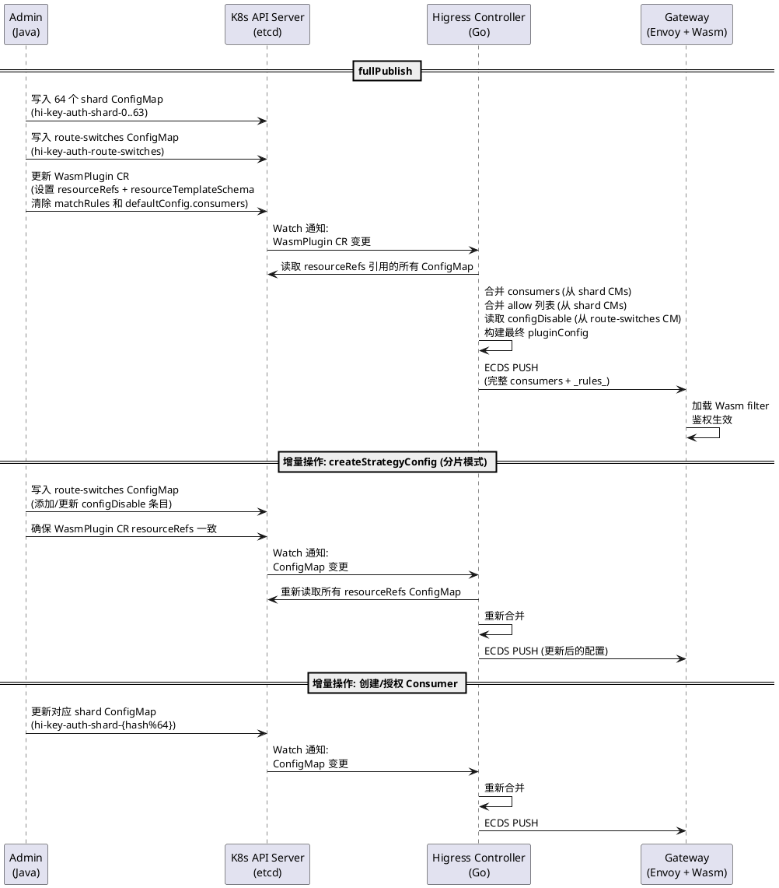

# 插件配置分片设计 - 当前实现

## 背景

WasmPlugin CR 存储在 etcd 中，受 etcd 1.5MB 单对象大小限制。当 consumers 数量达到 8K+ 或 MCP Server 达到 400+ 时，CR 会超限。分片方案将大配置拆分到多个 ConfigMap 中，由 Controller 在推送 ECDS 时合并。

## 实现架构

### 整体数据流



## 实现细节

### 1. CRD 扩展字段

```yaml
spec:
  resourceRefs:          # List<String> - 引用的 ConfigMap 名称列表
  - hi-key-auth-shard-0
  - hi-key-auth-shard-1
  - ...
  - hi-key-auth-shard-63
  - hi-key-auth-route-switches
  resourceTemplateSchema:  # 声明 ConfigMap data key 与配置字段的映射
  - key: consumers
    value: consumers
  - key: matchRules
    value: matchRules
```

**注意**：这两个字段必须在 CRD OpenAPI schema 中定义，否则 k8s API server 会 pruning 掉。

### 2. 分片 ConfigMap 结构

每个 `hi-key-auth-shard-{N}` ConfigMap 包含两个 data key：

```yaml
apiVersion: v1
kind: ConfigMap
metadata:
  name: hi-key-auth-shard-0
  labels:
    higress.io/biz-type: hi-key-auth-shard
    higress.io/internal: "true"
data:
  consumers: |
    - credential: Bearer xxxxx
      in_header: true
      in_query: false
      keys:
      - Authorization
      name: consumer-name-1
    - credential: Bearer yyyyy
      ...
  matchRules: |
    - config:
        allow:
        - consumer-name-1
      ingress:
      - route-id-1
```

### 3. 路由开关 ConfigMap

`hi-key-auth-route-switches` 独立管理每个路由的 key-auth 启用/禁用状态：

```yaml
apiVersion: v1
kind: ConfigMap
metadata:
  name: hi-key-auth-route-switches
  labels:
    higress.io/biz-type: hi-key-auth-route-switches
    higress.io/internal: "true"
data:
  matchRules: |
    - configDisable: false
      ingress:
      - ls-test-echo
    - configDisable: true
      ingress:
      - another-route
```

### 4. Controller 合并逻辑（Go）

`mergeShardedConfigMaps()` 在 `ingress_config.go` 中实现：

1. 遍历 `resourceRefs` 中的所有 ConfigMap
2. 区分 shard ConfigMap 和 route-switches ConfigMap
3. 从 shard ConfigMaps 聚合 `consumers`（追加到 `defaultConfig.consumers`）
4. 从 shard ConfigMaps 聚合 `matchRules`（按 ingress 合并 allow 列表）
5. 从 route-switches ConfigMap 读取 `configDisable` 状态
6. 构建最终 matchRules：每个 route 的 `allow`（来自 shards）+ `configDisable`（来自 switches）
7. 通过 ECDS 推送给数据面

### 5. Admin 侧分片逻辑（Java）

`KeyAuthShardingPublisher` 负责：

- **fullPublish**：全量重建所有分片（启动时 + 手动触发）
- **publishConsumer / removeConsumer**：增量更新单个 consumer 所在的 shard
- **publishAuthorization**：增量更新授权关系所在的 shard
- **addOrUpdateRouteSwitch / removeRouteSwitch**：管理路由开关

分片模式判断：`isShardingMode()` 通过数据面版本（higressVersion >= 2.1.12）判断，而非检查 CR 的 `resourceRefs` 字段。原因是 `resourceRefs` 是分片发布的结果，可能因 fullPublish 中途失败或并发冲突处于不一致状态，用版本判断更可靠。

### 6. 策略配置 CRUD 在分片模式下的行为

`HigressStrategyInstanceAdapter.create()` 中：

```
if (isKeyAuthNonGlobalScope && isShardingMode) {
    // 直接操作 route-switches ConfigMap，不写 CR 的 matchRules
    keyAuthShardingPublisher.addOrUpdateRouteSwitch(...)
    return;  // 不走 service.addOrUpdate()
}
```

这避免了 `addOrUpdate` 覆盖 CR 中的 `resourceRefs`。

## 分片策略

- **Hash 函数**：MurmurHash3_32（Guava `Hashing.murmur3_32_fixed()`）
- **分片键**：consumer name
- **桶数**：固定 64
- **ConfigMap 命名**：`hi-key-auth-shard-{Math.floorMod(hash, 64)}`
- **空桶处理**：空桶的 ConfigMap 会被删除

## 已知约束和注意事项

1. **CRD 必须包含 resourceRefs 字段定义**：否则 k8s pruning 会丢弃该字段，导致 Controller 无法读取分片数据
2. **C++ key-auth 插件不允许重复 credential**：如果合并后出现重复 credential，插件会拒绝整个配置
3. **ConfigMap 变更触发 ECDS 推送**：任何 shard ConfigMap 的变更都会触发 Controller 重新合并并推送，需注意批量操作时的推送风暴。当消费者数量进一步增长时，全量推送到 Wasm 插件内存的模式本身就是瓶颈（推送耗时、内存占用）。更彻底的方案是让 Wasm 插件运行时直接查询 Redis 进行认证鉴权匹配，而非在内存中加载全部 consumer 和授权数据，从根本上消除推送风暴和内存压力
4. **分片数固定为 64**：如果未来需要 reHash，需要先创建新 ConfigMap，更新 resourceRefs，再删除旧 ConfigMap
5. **route-switches 与 shard matchRules 分离**：configDisable 只在 route-switches 中管理，shard 中只有 allow 列表

## 文件清单

| 文件 | 职责 |
|------|------|
| `KeyAuthShardingPublisher.java` | Admin 侧分片写入逻辑 |
| `HigressStrategyInstanceAdapter.java` | 策略 CRUD 分片模式路由 |
| `ingress_config.go` (`mergeShardedConfigMaps`) | Controller 侧合并逻辑 |
| `V1alpha1WasmPluginSpec.java` | CR 模型（含 resourceRefs 字段） |
| `helm/crds/customresourcedefinitions.gen.yaml` | CRD schema 定义 |
| `KeyAuthPublishEventListener.java` | 增量发布事件监听 |
